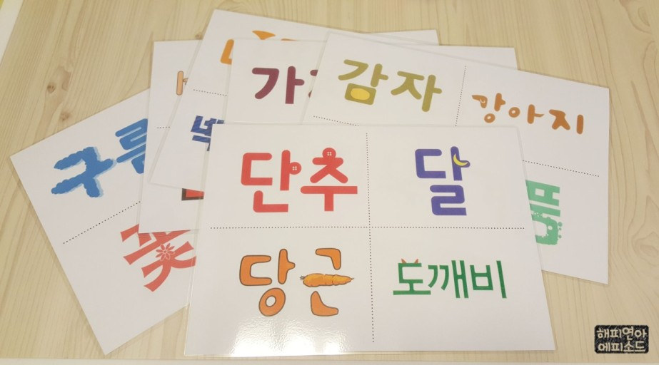

```{r setup, include=FALSE}
knitr::opts_chunk$set(echo = FALSE)
```


# 내가 기대하는 텍스트 분석

음성 인식(Speech Recognition)이란 사람이 말하는 음성 언어를 컴퓨터가 해석해 그 내용을 문자 데이터로 전환하는 처리를 말합니다. **STT(Speech-to-Text)**라고도 합니다. 

상담센터의 상담 내용을 텍스트화한 STT 데이터를 **자연어 처리(NLP, Natural Language Processing)하여 함축되어 있는 고객의 의도를 이해**합니다.

<br>

```{r network, echo=FALSE, out.width = "55%", fig.align='center'}

```


<br>

```{r gis, echo=FALSE, out.width = "70%", fig.align='center'}
knitr::include_graphics("img/english.png")
```

